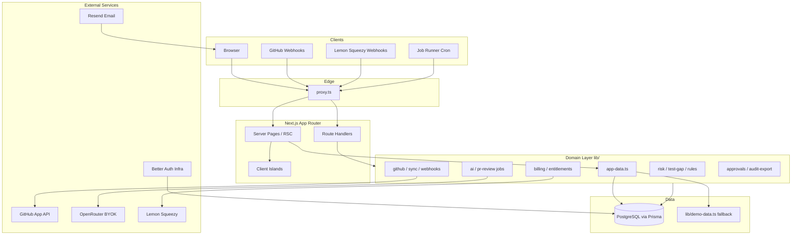

# System Design

**Status:** `current`
**Last verified:** 2026-05-31 (architecture and UI layers verified against code)

AgentGate is a multi-tenant Next.js application that ingests GitHub pull request activity, runs deterministic governance signals, enforces plan entitlements, persists audit evidence, and exposes an operational UI for engineering teams.

For UI tokens, component rules, and merge checklists, read [`features/DESIGN_SYSTEM.md`](features/DESIGN_SYSTEM.md) after this document.

For deep-dive HTML references (auth, database, governance, GitHub, jobs, billing, AI, frontend, security, deployment, audit), open [`architecture/index.html`](architecture/index.html).

## Design Principles

1. **Organization-scoped truth** — business data always belongs to an organization; never query across tenants.
2. **Deterministic governance first** — risk, test gaps, and rules are code-driven signals; AI review is advisory and secondary in UX.
3. **Server Components by default** — pages fetch on the server; client islands are small and purposeful.
4. **Fail closed in production** — missing auth, database, or integration config blocks real behavior; dev can fall back to demo data.
5. **Flat operational UI** — bordered surfaces, semantic tokens, dense tables; no decorative AI aesthetics (see design system).

## High-Level Architecture



## Runtime Layers

| Layer         | Location                        | Responsibility                                                                                                                   |
| ------------- | ------------------------------- | -------------------------------------------------------------------------------------------------------------------------------- |
| Edge gate     | `proxy.ts`                      | Session redirect, rate limits, security headers, CSRF on API mutations, `x-agentgate-pathname` header                            |
| Root layout   | `app/layout.tsx`                | Fonts, `ThemeProvider` (next-themes), `TooltipProvider`, `Toaster` (Sonner), `NuqsAdapter`, org context for shell, `globals.css` |
| Shell routing | `components/app/root-shell.tsx` | Public routes vs authenticated `AppShell`                                                                                        |
| App shell     | `components/app/app-shell.tsx`  | Sidebar, mobile drawer, plan/data-mode badges, skip link                                                                         |
| Pages         | `app/**/page.tsx`               | Server-rendered product surfaces; async `searchParams` + `params`                                                                |
| API           | `app/api/**/route.ts`           | Webhooks, jobs, billing, exports, mutations                                                                                      |
| Data access   | `lib/data/app-data.ts`          | Cached org context, org-scoped lists/detail reads, demo fallback                                                                 |
| Domain logic  | `lib/*.ts`                      | Pure or service-boundary modules (risk, billing, github, ai, jobs)                                                               |
| Persistence   | `prisma/schema.prisma`          | Multi-tenant schema; migrations under `prisma/migrations`                                                                        |

## Request Lifecycle

### Authenticated page request

1. `proxy.ts` checks session (or allows dev demo without DB).
2. Request proceeds with `x-agentgate-pathname` set.
3. `app/layout.tsx` loads org via cached `getCurrentOrganization()` for shell props.
4. `RootShell` renders `AppShell` for app routes.
5. Page server component parses URL state (`search-params.ts` + `nuqs`), loads org-scoped data from `app-data.ts`, renders with shared layout components.

### API / webhook request

1. `proxy.ts` applies rate limits and origin checks (mutations except auth/jobs/webhooks).
2. Route handler validates auth (session, bearer job secret, or provider signature).
3. Handler delegates to domain module; writes through Prisma when configured.
4. Structured logs via `lib/observability.ts` on errors.

## Multi-Tenancy Model

**Tenant root:** `Organization`

Every business entity (repositories, pull requests, rules, approvals, audit events, usage, AI settings, webhook deliveries) is scoped by `organizationId`. Session resolution in `lib/auth/session.ts` maps the signed-in user to a membership role (`owner`, `admin`, `member`, `viewer`).

**Request-scoped org context:** use `getCurrentOrganization()` from `lib/data/app-data.ts` (React `cache`) — do not re-fetch session + membership independently on the same page.

**Demo mode:** when `DATABASE_URL` is absent in development, `app-data.ts` serves `lib/demo-data.ts`. Production requires PostgreSQL.

**Platform admin exception:** the operator console under `/admin` is the one surface that reads across tenants, exclusively through `lib/admin/admin-data.ts`. It is gated by the `ADMIN_EMAILS` allowlist (`lib/admin/access.ts`), enforced in `app/admin/layout.tsx` and re-checked in every admin server action. See [`features/ADMIN.md`](features/ADMIN.md).

## Core Domain Flows

### 1. GitHub connect and sync

```
/settings/github → GitHub App install → /api/github/installation
→ organization.githubInstallationId stored
→ manual sync / webhooks → lib/github-sync.ts
→ repositories + pull requests persisted → risk/test-gap/rules evaluated
```

Webhook deliveries hit `/api/github/webhook`, dedupe by delivery id, queue for `/api/jobs/github-webhooks`. Usage metering (`lib/usage.ts`) counts monthly PR checks against plan limits.

### 2. Governance pipeline (deterministic)

On PR ingest or update:

| Signal      | Module                         | Output                                            |
| ----------- | ------------------------------ | ------------------------------------------------- |
| Attribution | `lib/agents/attribution.ts`    | `agentSource`, `aiAssisted`, confidence, evidence |
| Risk score  | `lib/risk.ts`                  | `RiskLevel`, path/title heuristics                |
| Test gap    | `lib/test-gap.ts`              | `TestGapStatus`, suggested test paths             |
| Rules       | `lib/rules.ts`                 | Violations, required actions                      |
| Activity    | `lib/data/app-data.ts` mappers | Timeline events                                   |

Attribution is explainable (weighted evidence from commit trailers, bot accounts, emails, branch prefixes, labels) and configurable per organization via the Agent Identity Registry (`/settings/agents`). See [`features/AI_GOVERNANCE.md`](features/AI_GOVERNANCE.md).

These signals drive badges, dashboards, and approval requirements — not LLM output.

### 3. Approvals and audit

Approval actions on PR detail pages call server paths guarded by role + plan entitlements (`lib/entitlements.ts`). Decisions update PR status, write `AuditEvent` rows, and optionally post GitHub comments/check runs when entitled.

Audit CSV export: `/api/audit-log/export` gated by `auditExport` entitlement and retention window (`lib/audit-export.ts`).

### 4. Billing and entitlements

| Concern           | Module                             |
| ----------------- | ---------------------------------- |
| Checkout / portal | `lib/billing.ts`, `/api/billing/*` |
| Subscription sync | `lib/lemon-squeezy-webhooks.ts`    |
| Plan metadata     | `lib/plans.ts`                     |
| Feature gates     | `lib/entitlements.ts`              |

Entitlements are enforced server-side before mutations and exports — UI should reflect limits but never be the only gate.

### 5. AI review (advisory, queued)

```
Repository settings (/repositories/[id]/ai) + org OpenRouter key (/settings/ai)
→ job queued on PR events → /api/jobs/pr-reviews
→ lib/jobs/pr-review-worker.ts (lifecycle, diff filter, validation)
→ model execution intentionally disabled today → skipped status
```

AI output is sanitized before any GitHub publish (`lib/github/output.ts`). Treat AI as a supporting signal in UI copy and layout.

## UI System Architecture

AgentGate UI is a **three-layer component model**. Keep new work in the correct layer to preserve consistency.

```
app/globals.css          ← design tokens (source of truth for color, radius, shadow)
    ↓
components/ui/*          ← primitives (Button, Badge, Card, Table, Sheet, DropdownMenu…) — style only, minimal logic
    ↓
components/app/*         ← product components (PageHeader, Section, AppShell, status badges, filters)
    ↓
app/**/page.tsx          ← route composition — data fetch + layout, almost no raw styling
```

### Component library (`components/ui/`)

Primitives are **shadcn-style** — Radix UI behavior plus `class-variance-authority` where variants are needed — but they are wired to **AgentGate's own semantic tokens**, not shadcn's default palette. `components.json` exists so the shadcn CLI is usable, but anything produced by `npx shadcn add` must be re-tokenized before merge: this project redefines `accent` as brand indigo (stock shadcn treats `accent` as a neutral hover surface) and uses `surface-*`, `danger`, and `focus-ring` instead of `card` / `popover` / `destructive` / `ring`.

| Primitive                                          | Basis               | Notes                                                          |
| -------------------------------------------------- | ------------------- | -------------------------------------------------------------- |
| `Button`                                           | cva + Radix Slot    | `default`, `secondary`, `ghost`, `accent`, `danger`, `outline` |
| `Badge` / `StatusDot`                              | tokens              | domain tones (see status badges below)                         |
| `Card` (+ Header/Title/Description/Content/Footer) | tokens              | framed data panels                                             |
| `Input`, `Textarea`                                | tokens              | form controls with `aria-invalid` styling                      |
| `Select`                                           | native `<select>`   | **form primitive** for uncontrolled `FormData` forms           |
| `Table` (+ subcomponents)                          | tokens              | dense scan-and-review tables                                   |
| `Skeleton`                                         | tokens              | shimmer / pulse loading                                        |
| `Sheet`                                            | Radix Dialog        | side drawer (mobile navigation)                                |
| `DropdownMenu`                                     | Radix DropdownMenu  | row / overflow action menus                                    |
| `Tabs`                                             | Radix Tabs          | tabbed panels                                                  |
| `Switch`                                           | Radix Switch        | boolean form toggles (submits `on` when checked)               |
| `Separator`                                        | Radix Separator     | standalone dividers                                            |
| `Avatar` (+ Image/Fallback)                        | Radix Avatar        | identity initials                                              |
| `Progress`                                         | Radix Progress      | usage / completion meters (`indicatorClassName` for tone)      |
| `Label`                                            | Radix Label         | explicit control labels                                        |
| `Tooltip`                                          | Radix Tooltip       | hover/focus labels; one root `TooltipProvider` in the layout   |
| `Toaster`                                          | Sonner              | transient mutation feedback; theme-synced via `next-themes`    |
| `Command`                                          | cmdk + Radix Dialog | ⌘K command palette (`components/app/command-palette.tsx`)      |

Theming: light tokens in `:root`, a `.dark` scale overrides the same vars, and
`@theme inline` maps `--color-* → var(--*)` so the `.dark` class re-themes all
utilities at runtime. `next-themes` drives it (provider + `@custom-variant dark`).
See [`features/DESIGN_SYSTEM.md`](features/DESIGN_SYSTEM.md) for the token detail.

Primitive rules:

- Prefer a `components/ui/*` primitive over inline Radix or ad-hoc markup. The mobile nav drawer uses `Sheet`, not a raw `@radix-ui/react-dialog`.
- Keep native `<select>` (`Select`) for uncontrolled forms that submit via `FormData`. A richer Radix Select is intentionally **deferred** to avoid empty-value and form-bubble regressions in core mutation flows.
- `Toast` and `Tooltip` are **not built yet** (no `@radix-ui/react-tooltip` dependency); add them as tokened primitives when a real need lands.

### Shell and route classes

| Route class           | Shell                         | Pattern                                                                |
| --------------------- | ----------------------------- | ---------------------------------------------------------------------- |
| Public marketing/auth | Plain `bg-background` wrapper | `app/page.tsx`, `/sign-in`, `/sign-up`, password reset                 |
| Authenticated app     | `AppShell` sidebar + header   | All `/dashboard`, `/repositories`, `/pull-requests`, `/settings`, etc. |

Navigation groups in `app-shell.tsx`: **Overview**, **Review work**, **Workspace**, and a **Platform** group rendered only for platform admins (`isAdmin`). Match this grouping when adding routes.

### Standard page composition

Authenticated list pages follow this structure (see `app/pull-requests/page.tsx`):

```tsx
<div className="space-y-6">
  <PageHeader eyebrow="…" title="…" description="…" actions={…} />
  <Card>
    <CardContent className="space-y-5">
      <RouteFilters />           {/* nuqs client island */}
      <Suspense fallback={<TableSkeleton … />}>
        <DataTable … />          {/* async server component */}
      </Suspense>
    </CardContent>
  </Card>
</div>
```

Detail pages use `PageHeader` + `Section` variants (`default` bordered panel or `plain` for stacked content). Prefer `Section` over ad-hoc bordered `div`s.

### URL-driven list state

| Piece          | Location                       | Rule                                                                                 |
| -------------- | ------------------------------ | ------------------------------------------------------------------------------------ |
| Parsers        | `app/<route>/search-params.ts` | `createSearchParamsCache`, shared with filters                                       |
| Server read    | Page async child               | `searchParamsCache.parse(searchParams)` before data fetch                            |
| Client filters | `app/<route>/filters.tsx`      | `useQueryStates` with same parser map; `shallow: false` when data is server-rendered |

Export routes and audit filters must stay key-compatible with list pages.

### Status and metadata display

Use domain badges from `components/app/status-badge.tsx` — do not invent new color semantics:

| Component       | Domain           |
| --------------- | ---------------- |
| `RiskBadge`     | `RiskLevel`      |
| `TestGapBadge`  | `TestGapStatus`  |
| `CiBadge`       | `CiStatus`       |
| `ApprovalBadge` | `ApprovalStatus` |
| `AiReviewBadge` | `AiReviewStatus` |

Tone mapping lives in design system (`slate`, `green`, `yellow`, `orange`, `red`, `blue`). Reuse `Badge` from `components/ui/badge.tsx` for new metadata tags.

### Shared UI building blocks

| Need                     | Use                                                               |
| ------------------------ | ----------------------------------------------------------------- |
| Page title block         | `PageHeader`                                                      |
| Grouped content panel    | `Section`                                                         |
| Empty results            | `EmptyState` from `empty-state.tsx`                               |
| Filter result count      | `ResultSummary`                                                   |
| Shareable filters        | `UrlFilterForm` / route `filters.tsx`                             |
| Loading                  | Route `loading.tsx` + `page-loading.tsx` skeletons                |
| Settings sub-nav         | `settings-nav.tsx`                                                |
| Side drawer / mobile nav | `Sheet`                                                           |
| Row / overflow actions   | `DropdownMenu`                                                    |
| Boolean toggle           | `Switch` (with `Label`)                                           |
| Progress / usage meter   | `Progress`                                                        |
| Identity initials        | `Avatar`                                                          |
| Standalone divider       | `Separator`                                                       |
| Charts                   | `components/charts/*` via dynamic import (Recharts client island) |

### UI consistency rules for agents

Before shipping UI changes:

1. Read this section **and** [`features/DESIGN_SYSTEM.md`](features/DESIGN_SYSTEM.md).
2. Use semantic token classes (`bg-surface`, `text-foreground`, `border-border`) — not raw `slate-*` / `zinc-*` in pages.
3. Do not add linear gradient backgrounds unless explicitly requested.
4. Do not center generic "AI" branding — use task-oriented copy ("Review work", "Policy coverage").
5. Tables for scan workflows: sticky header, `sr-only` caption, badges with dots for status.
6. Forms: visible labels, `focus-visible:ring-focus-ring`, pending/`aria-busy` on filter submits.
7. Match existing page spacing: outer `space-y-6`, card inner `space-y-5`, section padding `p-5`.
8. New settings pages belong under `/settings/*` with `settings-nav.tsx` integration.

## Data Access Patterns

| Pattern                             | When                                                   |
| ----------------------------------- | ------------------------------------------------------ |
| `getCurrentOrganization()`          | Every authenticated page needs tenant context          |
| `list*` / `get*` in `app-data.ts`   | Reading org-scoped entities                            |
| In-memory filter after single fetch | Current list pages until DB pagination lands           |
| `Promise.all`                       | Independent params, searchParams, org, and data reads  |
| Server Actions / route handlers     | Mutations with role + entitlement checks               |
| `router.refresh()`                  | Client mutation success when server is source of truth |

Do not read `lib/demo-data.ts` directly from pages — go through `app-data.ts`.

## Background Jobs

Scheduled HTTPS POST with `Authorization: Bearer $JOB_RUNNER_SECRET`:

| Endpoint                    | Purpose                                    |
| --------------------------- | ------------------------------------------ |
| `/api/jobs/github-webhooks` | Process queued webhook deliveries          |
| `/api/jobs/pr-reviews`      | Process AI review queue                    |
| `/api/jobs/retention`       | Purge aged audit/webhook/billing artifacts |

Job idempotency uses deterministic ids (`lib/jobs/queue.ts`). See [`operations/OPERATIONS_RUNBOOK.md`](operations/OPERATIONS_RUNBOOK.md).

## Security Model

| Control              | Implementation                                                            |
| -------------------- | ------------------------------------------------------------------------- |
| Authentication       | Better Auth session cookie; production sign-in required                   |
| Authorization        | Org membership role checks in server paths                                |
| Plan enforcement     | `lib/entitlements.ts` on features and limits                              |
| CSRF / origin        | `proxy.ts` + `lib/security.ts` on API mutations                           |
| Rate limiting        | In-memory limiter in `lib/rate-limit.ts` (per IP + route class)           |
| Webhook verification | GitHub HMAC, Lemon Squeezy signature                                      |
| Secret handling      | Env via `lib/env.ts`; OpenRouter keys encrypted (`lib/ai/credentials.ts`) |
| Diagnostics          | `/api/diagnostics` owner/admin only                                       |

## Observability

Structured JSON logs only (`lib/observability.ts`). Release context from `VERCEL_GIT_COMMIT_SHA` or `APP_VERSION`. No Sentry/PostHog integration in app code today.

## Key Module Index

| Concern    | Primary modules                                                   |
| ---------- | ----------------------------------------------------------------- |
| Auth       | `lib/auth.ts`, `lib/auth/session.ts`, `lib/auth-client.ts`        |
| Org data   | `lib/data/app-data.ts`                                            |
| GitHub     | `lib/github.ts`, `lib/github-sync.ts`, `lib/github-webhooks.ts`   |
| Governance | `lib/risk.ts`, `lib/test-gap.ts`, `lib/rules.ts`                  |
| Approvals  | `lib/approvals.ts`                                                |
| Billing    | `lib/billing.ts`, `lib/lemon-squeezy-webhooks.ts`, `lib/plans.ts` |
| AI         | `lib/ai/*`, `lib/jobs/pr-review-*.ts`                             |
| Email      | `lib/email.ts`                                                    |
| Onboarding | `lib/onboarding.ts`                                               |

Full route and env reference: [`operations/SETUP.md`](operations/SETUP.md). HTTP API surface: [`features/API.md`](features/API.md).

## Related Docs

| Doc                                                                    | Use when                                      |
| ---------------------------------------------------------------------- | --------------------------------------------- |
| [`AGENT_START_HERE.md`](AGENT_START_HERE.md)                           | Starting any session                          |
| [`features/DESIGN_SYSTEM.md`](features/DESIGN_SYSTEM.md)               | Tokens, accessibility checklist, motion rules |
| [`operations/SETUP.md`](operations/SETUP.md)                           | Local setup, route list, module one-liners    |
| [`features/API.md`](features/API.md)                                   | Endpoint contracts                            |
| [`operations/OPERATIONS_RUNBOOK.md`](operations/OPERATIONS_RUNBOOK.md) | Jobs, incidents, retention                    |

When architecture or UI composition patterns change, update **this file** and cross-check `features/DESIGN_SYSTEM.md` for token-level details.
